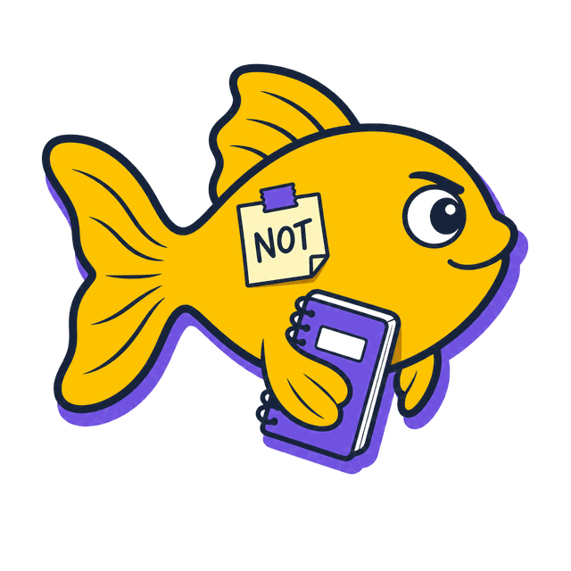
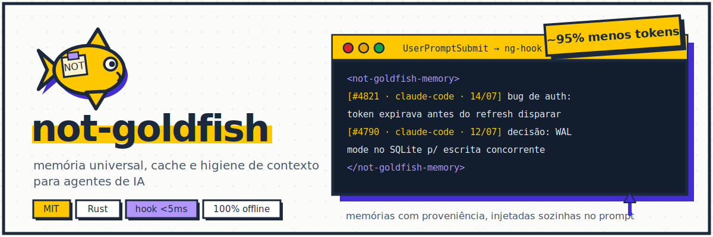
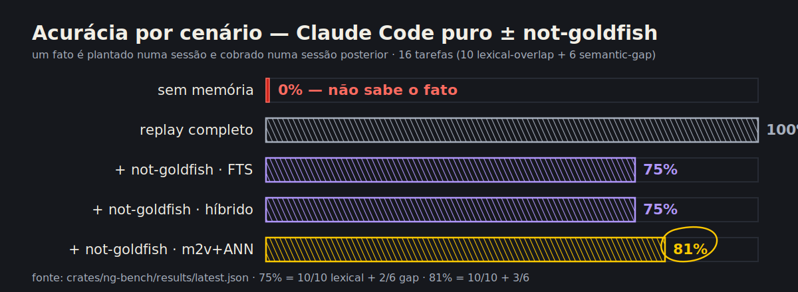
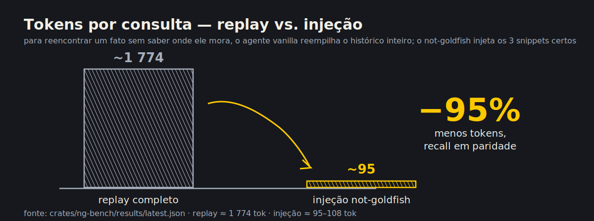
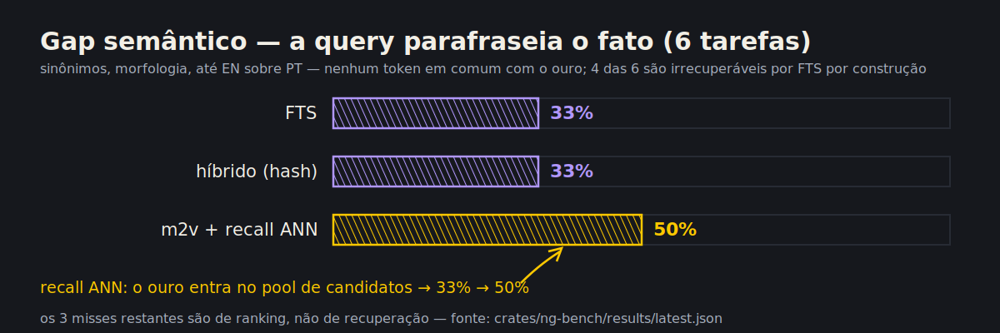
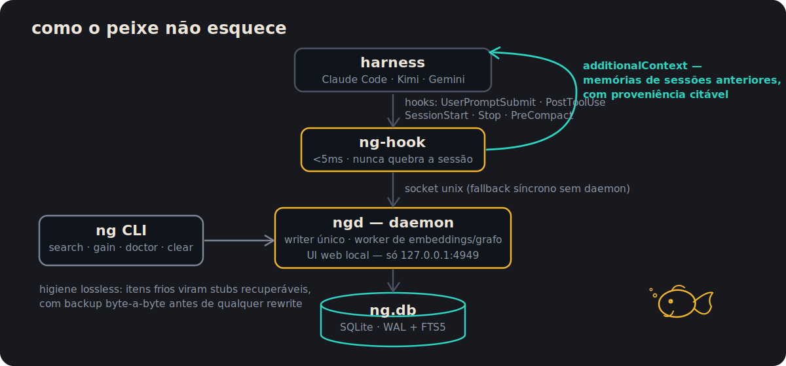

<p align="center">
  
</p>

<p align="center">
  
</p>

<p align="center">
  <a href="https://github.com/vmelooo/not-goldfish/actions/workflows/ci.yml"></a>
  <a href="./LICENSE"></a>
  
</p>

<p align="center"><a href="./README.md">Português</a> · <strong>English</strong></p>

A goldfish forgets everything with each lap around the bowl. Your coding agent does the same every session: it forgets what it decided, burns tokens redoing finished work, and hallucinates where it should simply remember. **not-goldfish** is the missing memory layer: it captures everything via harness hooks, stores it in a local SQLite, injects relevant memories back into the prompt — with provenance — and slims down the transcript without losing anything.

## Why

- **Stop re-explaining the project** on every new session — decisions, fixed bugs, and conventions from previous sessions come back to the context on their own.
- **Tokens aren't free** — restacking the entire history to find one fact again costs ~20x more than injecting the right 3 snippets.
- **Without memory, the agent makes things up** — every injected memory carries a citable id, harness, and date; below the relevance threshold, silence.
- **Long sessions bloat** — lossless hygiene swaps cold tool output for recoverable stubs before compaction, deleting nothing.

## Installation

```bash
curl -fsSL https://raw.githubusercontent.com/vmelooo/not-goldfish/main/install.sh | bash
```

No manual prerequisites: the installer provisions whatever is missing on its own — C toolchain (`cc`/`make`, for the SQLite compiled in via `bundled`), `git`, `curl`, and [Rust via rustup](https://rustup.rs/) (apt, dnf, yum, pacman, zypper, apk, or brew; on macOS, Xcode Command Line Tools). Prefer to manage it yourself? `--skip-deps`. Linux and macOS (for Windows, see the section below). First build: ~3–5 min; incremental after that.

The script does five things:

1. Installs any missing dependencies (C toolchain, git, curl, Rust).
2. Clones the repo into `~/.not-goldfish/src` (or uses the local checkout).
3. Builds in release mode.
4. Places `ng`, `ngd`, and `ng-hook` in `~/.cargo/bin` (rustup already keeps it on your PATH).
5. Registers the hooks for every Claude Code project — backing up `settings.json` (`settings.json.ng-backup`) before touching it.

To check that it worked:

```bash
ng doctor   # diagnostics: binaries, daemon, database, hooks, UI
ng ui       # local web UI at http://127.0.0.1:4949
```

From the next harness session on, everything is captured and memories from previous sessions start coming back to the prompt on their own.

### Windows (via WSL2)

Native Windows is **not supported**: the `ngd` daemon speaks over a Unix socket. The easy, honest path is WSL2 — ~10 min including the download.

1. Open PowerShell **as administrator** and run `wsl --install` (reboot if asked).
2. Open **Ubuntu** from the start menu.
3. Run the install one-liner: `curl -fsSL https://raw.githubusercontent.com/vmelooo/not-goldfish/main/install.sh | bash` — it installs the C toolchain and Rust on its own.
4. Done — harnesses running **inside WSL** see `ng` normally.

**Variations** — another harness, per-project scope, uninstall:

```bash
curl -fsSL https://raw.githubusercontent.com/vmelooo/not-goldfish/main/install.sh | bash -s -- --harness kimi   # Kimi Code (also: gemini)
ng install      # hooks only in the current project (.claude/settings.json), instead of global
ng uninstall    # exact inverse of install (--global for the global scope); database and memories stay intact
```

**Updating** — run the same one-liner again: the checkout does a `git pull`, the build is incremental, and `ng install` is idempotent — it won't duplicate hooks.

<details>
<summary><b>Rather not run <code>curl | bash</code>? Manual installation</b></summary>

The same flow from your own clone — the script detects the local checkout and uses it, cloning nothing:

```bash
git clone https://github.com/vmelooo/not-goldfish
cd not-goldfish
./install.sh
```

Or 100% by hand, no script at all:

```bash
cargo build --release
install -m 755 target/release/ng target/release/ngd target/release/ng-hook ~/.cargo/bin/
ng install --global
```

The three binaries like living side by side: `ng` locates `ngd` and `ng-hook` first in its own directory, falling back to the PATH.

</details>

Details, optional semantic embedder (`model2vec`), and troubleshooting: [`docs/SETUP.md`](docs/SETUP.md).

## Benchmarks

LoCoMo/mem0-style methodology: a fact is planted in a session and quizzed later. Measured on a **vanilla Claude Code** (no other tools) vs. **vanilla Claude Code + not-goldfish** — `ng-bench` is self-contained and offline. Details and method: [`docs/benchmarks/with-vs-without.md`](docs/benchmarks/with-vs-without.md) · visual dashboard: [`docs/benchmarks/charts.html`](docs/benchmarks/charts.html).



| Scenario | Accuracy | MRR | Grounding | Tokens injected | Savings vs replay |
|---|---|---|---|---|---|
| Vanilla Claude Code — no memory | 0% | — | 0% | 0 | doesn't know the fact |
| Vanilla Claude Code — full replay | 100% | 1.00 | 100% | ~1774 | 0% (baseline) |
| + not-goldfish — FTS | 75% | 0.69 | 75% | ~95 | **94.7%** |
| + not-goldfish — hybrid (hash) | 75% | 0.69 | 75% | ~89 | **95.0%** |
| + not-goldfish — model2vec + ANN recall | **81%** | **0.72** | **81%** | ~96 | **94.6%** |

**~95% fewer tokens than restacking the full history, with recall parity or better.** The real embedder (model2vec, opt-in) + ANN recall delivers the best accuracy and grounding (81%).



Honest about where it's hardest — the **semantic gap** (a query with no lexical terms in common with the fact). ANN recall recovered docs that FTS never matches, lifting accuracy from 33% → 50%; the remaining misses are now ranking problems, not retrieval ones:



In *your* environment, `ng gain` shows the accumulated benefit since adoption:

```bash
ng gain                    # captures, injections, and net tokens saved
ng gain --here --json      # current project only, stable output for scripts
```

## Features

**Memory**

- **Resilient capture** — every `UserPromptSubmit`/`PostToolUse`/`SessionStart`/`Stop` becomes an event with provenance (session, project, harness, timestamp); the hook runs in <5ms and never breaks the session.
- **Proactive injection with provenance** — on every prompt, relevant memories from *previous* sessions enter the context on their own, with citable id/harness/date, a relevance threshold, and a strict token budget.
- **Hybrid search** — FTS5 (bm25, IDF pruning) with semantic-similarity rerank; zero-dependency default embedder, swappable for a real one (`model2vec`) via feature flag.
- **Editable own memory** — `ng memory list/add/hide/unhide` and the UI; hiding is reversible, nothing disappears.
- **Committable `.ng/`** — `ng sync-context` projects the project's memory into regenerable `context.md`/`decisions.md`; the database remains the source of truth.

**Context**

- **Lossless hygiene** — `ng clear` (manual) and the `PreCompact` hook (automatic, opt-in) swap cold transcript items for recoverable stubs, with a byte-for-byte backup before any rewrite. Nothing is deleted from the database.
- **`ng gain`** — the accumulated benefit in *your* environment: captures, injections, and net tokens saved by hygiene, with honest accounting (injection is reported as a cost, not a saving).
- **Savings plugins (savers)** — external token compressors plug in via a CLI contract; everything is OFF by default and only promoted after being measured on your workload (`ng saver bench`).
- **Local web UI** — transcript timeline with a token-proportional bar, search alongside, remove/replace with stub with backup. Only on `127.0.0.1`, never `0.0.0.0`.

**Ecosystem**

- **Wisdom graph** — `ng wisdom` shows entities/decisions extracted from sessions; `--here --md` exports Markdown to paste into `CLAUDE.md`/`AGENTS.md`.
- **Multi-harness** — hook installers (claude/kimi/gemini), MCP registration (claude/codex), persona sync (claude/opencode), and keyword dispatch.

## How it works

<p align="center">
  
</p>

On every `UserPromptSubmit`, `ng-hook` looks up memories from *previous* sessions relevant to the prompt (never the current session — it's already in context) and injects them as `additionalContext`:

```
<not-goldfish-memory>
Memórias de sessões anteriores relevantes ao pedido (proveniência entre colchetes; use `ng search <termos>` para recuperar mais):
- [#4821 · claude-code · 2026-07-14] corrigido bug de auth: token expirava antes do refresh disparar >>
- [#4790 · claude-code · 2026-07-12] decisão: usar WAL mode no SQLite p/ escrita concorrente
</not-goldfish-memory>
```

Hygiene (manual via `ng clear` or automatic via `PreCompact` with `NG_AUTO_HYGIENE=1`) swaps the coldest transcript items for short, recoverable stubs — the last 20 items and every real user prompt are untouchable, a byte-for-byte backup (`*.ng-bak`) precedes any rewrite, and the file swap is always an atomic `rename`. Automatic mode is off by default: rewriting a live session's transcript is sensitive territory, and any failure at any step leaves the session untouched.

## Commands

| Command | What it does |
|---|---|
| `ng install [--global] [--harness claude\|kimi\|gemini]` | Registers the hooks in the harness (backup + idempotent). |
| `ng uninstall` | Removes only the not-goldfish hooks; database and memories stay intact. |
| `ng search <terms> [--here] [--semantic] [--json]` | Searches persistent memory (FTS5; `--semantic` enables hybrid rerank). |
| `ng status [--json]` | Database and daemon state. |
| `ng daemon` | Starts `ngd` in the foreground (use a service manager for background). |
| `ng ui` | Opens the local web UI (starts the daemon if needed). |
| `ng doctor` | Diagnostics with a one-line fix embedded in every warning/failure. |
| `ng clear [--dry-run] [--target-tokens N]` | Lossless hygiene for the active session: cold items become recoverable stubs. |
| `ng memory list\|add\|hide\|unhide` | Inspects/edits its own memory (hiding is reversible). |
| `ng gain [--here] [--since YYYY-MM-DD] [--json]` | Accumulated benefit: captures, injections, hygiene. |
| `ng sync-context [--init] [--dir <path>]` | (Re)generates `.ng/` — a committable projection of the project's memory. |
| `ng wisdom [--here] [--md] [--json]` | Wisdom graph (entities/decisions from sessions). |
| `ng saver init\|list\|bench` | External savers: measurement gate, everything OFF by default. |
| `ng sync [--global] [--personas-dir <path>]` | Syncs universal personas to each harness's format. |
| `ng dispatch <prompt>\|--init` | Suggests category + model for a prompt (pt/en keywords). |
| `ng mcp install-browser-use [--harness claude\|codex]` | Registers the browser-use MCP server (requires `uvx`). |
| `ng completions <shell>` | Completion script (bash/zsh/fish/elvish/powershell). |

### Architecture

```
crates/
├── ng-core     — store SQLite (WAL, FTS5), tags léxicas, embeddings
│                 (HashEmbedder + busca híbrida), grafo de sabedoria
├── ng-hook     — binário fino chamado pelos hooks (<5ms), injeção proativa,
│                 gate de higiene PreCompact; fallback síncrono sem daemon
├── ngd         — daemon: writer único via socket Unix, worker de embedding/
│                 grafo em background, UI web (axum, thread própria)
├── ng-sessions — parsers tolerantes a versão dos transcripts de cada harness
│                 + rewrite seguro (backup + rename atômico)
├── ng-adapters — integração multi-harness pura/testável: hooks, MCP,
│                 personas, dispatch, watcher de transcripts
└── ng-cli      — o CLI `ng` (tabela acima)
```

Data lives in `~/.not-goldfish/` (`NG_DATA_DIR` to customize). Events are the source-of-truth log; semantic search, eviction, and the UI are derivations of that log, never owners of it.

### Environment variables

| Variable | Default | Effect |
|---|---|---|
| `NG_DATA_DIR` | `~/.not-goldfish` | Data root: database (`ng.db`), socket (`ngd.sock`), pid, lock. |
| `NG_INJECT` | on | `0`/`false`/`off` disables proactive injection. |
| `NG_INJECT_LIMIT` | `3` | Maximum memories injected per prompt. |
| `NG_INJECT_MAX_RANK` | `-1.0` | Relevance cutoff (bm25, lower = better). |
| `NG_INJECT_BUDGET` | `600` | Token budget for the `<not-goldfish-memory>` block. |
| `NG_AUTO_HYGIENE` | off | `1` enables automatic lossless eviction on `PreCompact`. |
| `NG_HYGIENE_TARGET_TOKENS` | `20000` | Tokens the hygiene pass tries to free per `PreCompact`. |
| `NG_UI_PORT` | `4949` | Web UI port (always on `127.0.0.1`). |
| `NG_AUTOSTART` | on | `0` disables `ngd` autostart by `ng-hook`. |
| `NG_HARNESS` | `claude-code` | Harness label recorded on every captured event. |
| `NG_DEBUG_TIMING` | off | Prints each hook hot-path step's timing to stderr. |

## Invariants

- **Capture never breaks the harness session** — `ng-hook` always exits with code 0, even on failure; losing a memory is acceptable, breaking the user's flow is not.
- **Nothing captured is deleted** — hygiene/eviction only replaces with a recoverable stub or removes from the *active* transcript, never from the database or the backup.
- **The hook hot path has a <5ms budget** — all heavy work (embeddings, graph) runs in the background in `ngd`.
- **The web UI binds only to `127.0.0.1`, never `0.0.0.0`** — transcripts contain prompts, tool outputs, and sometimes secrets.

## Documentation

| Doc | What's in it |
|---|---|
| [`docs/SETUP.md`](docs/SETUP.md) | Detailed installation, semantic embedder (`model2vec`), troubleshooting. |
| [`docs/benchmarks/with-vs-without.md`](docs/benchmarks/with-vs-without.md) | LoCoMo-style methodology, bias audit, per-class results. |
| [`docs/benchmarks/charts.html`](docs/benchmarks/charts.html) | Visual benchmark dashboard (open in a browser). |
| [`docs/research/tooling-gains.md`](docs/research/tooling-gains.md) | Research: context tooling gains. |
| [`CONTRIBUTING.md`](CONTRIBUTING.md) | Build, tests, lints, and the invariants a PR cannot break. |

## Contributing

Build, tests, lints, and the invariants a PR cannot break: [`CONTRIBUTING.md`](CONTRIBUTING.md).

## License

[MIT](LICENSE) © 2026 Vitor Mello.
