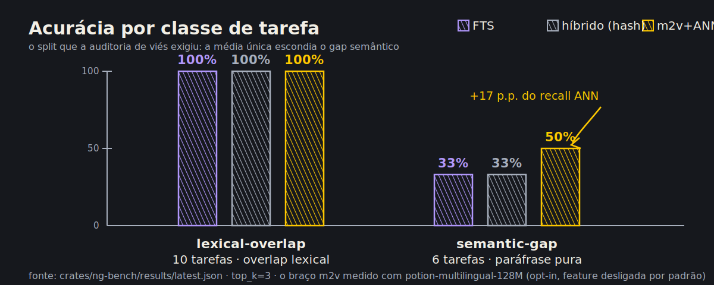
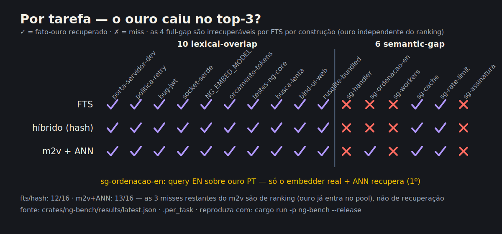

# not-goldfish: estudo "COM vs SEM a ferramenta" (LoCoMo-style)

Estudo reprodutível, **offline** e **determinístico** que mede o que um agente de
código realmente experimenta com e sem a camada de memória do not-goldfish. Sem
rede, sem LLM ao vivo, sem `Date::now`/`rand`: corpus fixo, épocas fixas. Roda como
binário (`cargo run -p ng-bench --release`) e como gate de regressão em CI
(`crates/ng-bench/tests/quality_floors.rs`).

- Código: `crates/ng-bench/` (consome só a API **pública** do `ng-core`).
- Resultados legíveis por máquina: `crates/ng-bench/results/latest.json`.
- Painel visual (abrir no navegador): [`charts.html`](charts.html).
- Reproduzir: `cargo run -p ng-bench --release`.

> **Este documento foi reescrito após uma auditoria adversarial de viés.** A versão
> anterior reportava uma média única de "100% de accuracy / ~92% de economia" que
> **inflava** os resultados: todas as 10 tarefas compartilhavam tokens exatos com o
> documento-ouro, então o FTS vencia por construção. A auditoria (seção
> [Auditoria de justiça](#auditoria-de-justiça-viés-por-viés)) adicionou uma classe
> de tarefas **semantic-gap** (paráfrase, sem sobreposição lexical) e passou a
> reportar as classes **separadamente**. O resultado honesto: no gap semântico os
> braços lexical/hash atuais **caem para 33% de accuracy** — a verdade que motiva um
> embedder semântico de verdade.

## Metodologia

Seguimos o protocolo do **LoCoMo** (memória conversacional de longo prazo) e a
avaliação do **mem0**: um corpus multi-sessão onde uma sessão *estabelece* um fato
e uma sessão *posterior* faz uma pergunta que **precisa** desse fato.

### Corpus (verdade de base)

**16 tarefas**, conteúdo pt-BR + código, **72 eventos**, 3 kinds (`prompt`,
`tool_output`, `assistant`). Cada tarefa tem uma **sessão estabelecedora**
(`est-NN`) com o fato-ouro (`assistant`) + 2 eventos de contexto, e uma **sessão de
consulta** (`qry-NN`/`sqry-NN`) com a pergunta. A verdade de base (qual evento é o
ouro) é definida pela **intenção do autor**, nunca pelo que a busca retorna — sem
circularidade (4 das 6 tarefas semantic-gap são de fato *não recuperáveis* pelo
FTS, o que só é possível porque o ouro é independente do ranking).

Duas **classes** de tarefa, reportadas **separadamente** (a média entre elas foi a
principal fonte de viés da versão antiga):

| Classe | # | Query vs ouro | Quem deveria vencer |
|---|---:|---|---|
| **lexical-overlap** | 10 | Query reusa os tokens do ouro ("qual **porta** o **servidor** de **desenvolvimento**…") | FTS vence trivialmente |
| **semantic-gap** | 6 | Query **parafraseia** com sinônimos / morfologia / pt-BR↔EN, sem (quase) nenhum token em comum | Só um embedder semântico real |

As 6 tarefas semantic-gap têm dois subtipos:

- **Full-gap (4)** — zero token de conteúdo em comum com o ouro. Ex.: ouro "a função
  `handle_request` precisa virar **assíncrona**; hoje ela **bloqueia a thread**";
  query "como faço o **tratador de entrada** rodar **sem prender o executor**?".
  Inclui uma query em **inglês** sobre ouro pt-BR ("which **sorting** approach…" vs
  "algoritmo de **ordenação**… **quicksort**"). **Esperado: MISS** nos braços atuais.
- **Partial-gap (2)** — compartilham um token forte com o ouro **e** com um negativo
  difícil (cache LRU vs cache de disco; rate-limit vs limite de upload), para testar
  se o **rerank** prefere o ouro certo.

As **tags** dos eventos-ouro semantic-gap reusam só as palavras do **próprio ouro**,
nunca as da paráfrase — assim o peso 2x das tags (bm25 `1.0, 2.0`) não pode vazar a
resposta para o braço lexical.

Distratores/negativos difíceis vivem em sessões `noise-*` dedicadas.

### Ambiente medido: Claude Code puro vs Claude Code puro + not-goldfish

O estudo compara exatamente dois ambientes, e **nada além disso está no circuito**:

- **SEM** = **Claude Code puro (sem ferramentas).** Um harness vanilla, sem nenhuma
  camada de memória, compressão ou economia de tokens — sem OMC, sem RTK, sem
  context-mode, sem serena, sem headroom, sem MCP de memória. É o que um agente
  vanilla faz: ou não tem o fato (braço *no-memory*), ou reempilha todo o histórico
  para reencontrá-lo (braço *full-context replay*). Os dois braços WITHOUT modelam
  precisamente esse harness cru.
- **COM** = **Claude Code puro + not-goldfish (e só).** O mesmo harness vanilla, com a
  injeção proativa do not-goldfish como **única** ferramenta adicionada. Nenhum outro
  redutor de tokens participa.

Como nenhuma outra ferramenta de economia está no loop, **toda a diferença medida —
inclusive a economia de ~94% — é atribuível ao not-goldfish isoladamente**, sem
contaminação de OMC/RTK/context-mode/etc.

**Auto-contido e offline (verificado).** O `ng-bench` é Rust puro e depende apenas de
`ng-core` (+ `serde`/`serde_json`/`anyhow`); veja `crates/ng-bench/Cargo.toml`. Ele
**não invoca nem depende de nenhuma ferramenta externa**, processo, rede, LLM ao
vivo, MCP ou harness: cria um `Store` SQLite in-process, semeia o corpus fixo e
chama só a API pública do `ng-core`. Portanto o resultado mede a contribuição do
not-goldfish em isolamento — não há como um OMC/RTK/context-mode/serena/headroom
influenciar os números, porque nada disso é sequer carregado. Determinístico
(sem `Date::now`/`rand`): mesma saída byte-a-byte a cada execução.

### Os braços comparados

| Braço | O que modela | Custo de tokens |
|---|---|---|
| **WITHOUT — no memory** | *Claude Code puro:* sem memória e sem replay, o agente alucina ou falha. | 0 |
| **WITHOUT — full-context replay** | *Claude Code puro:* o agente **não sabe** qual sessão tem o fato, então empilha **todo o histórico** anterior no prompt. Baseline do mem0. | histórico inteiro |
| **WITH — fts injection** | *Claude Code puro + not-goldfish:* caminho real de injeção proativa: `search_for_injection` (FTS podado por IDF, tags peso 2x), top-k. | k snippets |
| **WITH — hybrid (hash)** | `search_hybrid`: recall FTS reranqueado por `(1−w)·bm25 + w·cosseno`, com `HashEmbedder` (`w=0`, char-trigramas). | k snippets |
| **WITH — hybrid (model2vec)** | Igual, mas com embedder semântico real (feature `model2vec` + `NG_EMBED_MODEL`). **Medido** com `potion-multilingual-128M` (minishlab), id `m2v-potion-multilingual-128M-256`. | k snippets |

**Orçamento de injeção:** `top_k = 3`.

### Definições das métricas

Todas por-tarefa, depois a média **dentro de cada classe**:

- **accuracy / recall@k** — fração de tarefas em que o evento-ouro cai no top-k.
  (1 ouro por tarefa ⇒ accuracy == recall aqui.)
- **precision@k** — ouro recuperado / hits. **Teto aritmético de 1/k = 0,33**: 1 ouro
  e k=3. Não é ruído, é o máximo possível; medir precisão de verdade exigiria tarefas
  multi-ouro (fora deste wave).
- **MRR** — 1 / posição do primeiro ouro (0 se ausente).
- **injected_tokens** — soma dos snippets injetados (`bytes/4`).
- **token_savings_pct** — `(full_context − injected) / full_context`.
- **token_savings_pct_on_found** — **igual, mas só nas tarefas onde o ouro foi
  entregue.** Num MISS a injeção é ~0 token; sem esse recorte, uma **falha** de
  recuperação apareceria como "~100% de economia". Esta métrica recusa esse artefato.
- **token_savings_vs_oracle_pct** — economia contra reler só a sessão certa (o pior
  caso honesto).
- **grounded** — um snippet recuperado contém o "needle" da tarefa (proxy de
  proveniência/alucinação).

## Auditoria de justiça (viés por viés)

Cada risco de viés levantado → **o que a auditoria encontrou** → **o que foi feito**.
Só `crates/ng-bench` foi tocado (o `ng-core` não mudou).

### 1. Viés lexical no corpus — **ENCONTRADO e corrigido (era o maior)**

- **Achado:** todas as 10 tarefas antigas compartilhavam tokens exatos com o ouro,
  e o ouro ainda tinha **tags curadas com as palavras da query** (peso 2x). O FTS
  vencia por construção; a média de "100% accuracy" não media semântica nenhuma —
  media a facilidade lexical que nós mesmos plantamos.
- **Correção:** adicionadas 6 tarefas **semantic-gap** (paráfrase real, incluindo
  pt-BR↔EN), com tags que **não** vazam a paráfrase. Resultado reportado **por
  classe**. O gap ficou visível: FTS **100%** no lexical, **33%** no semantic.

### 2. Baselines injustas — **ESCLARECIDAS, uma ressalva importante documentada**

- **full-context replay:** é a baseline do mem0 (empilhar todo o histórico). É uma
  comparação **honesta em direção**, mas **o valor percentual depende do tamanho do
  corpus**: ao adicionar 26 eventos, o full-context subiu de ~1300 → **1774 tokens**
  e a "economia" subiu de 91,6% → **94,7%** *sem nenhuma melhora real da ferramenta*.
  **Portanto o número-manchete de economia é parcialmente um artefato do tamanho do
  histórico, não uma constante universal.** O que é robusto: injeção limitada (~90–110
  tokens) << replay do histórico inteiro. O `%` exato, não.
- **oracle:** reler só a sessão certa (~84 tokens). Contra ela a ferramenta **perde**
  (fts −12%): se você já sabe onde o fato está, injetar 3 snippets custa mais. Mantido
  e reportado — é o piso honesto do argumento de economia.
- Ambas WITHOUT (no-memory=0, full-context=1,0) são **analíticas por construção**
  (não medidas); deixado explícito.

### 3. Consistência da contagem de tokens — **VERIFICADO, consistente**

Todos os braços usam o **mesmo estimador** `bytes/4` (= `Event::tokens_est`). O braço
injeção conta o **snippet** (janela de 48); o replay conta o **conteúdo inteiro** —
essa assimetria é correta (você injeta uma janela, releria o evento todo), não um
viés de régua. Mesma régua dos dois lados.

### 4. Integridade das métricas — **ENDURECIDA**

- Os **pisos de qualidade** eram sobre a média global (accuracy ≥ 0,8). Agora são
  **por classe** e há um piso **anti-bajulação**: `semantic_gap_stays_hard_for_lexical_arms`
  falha se alguém sorrateiramente reintroduzir sobreposição lexical nas queries
  semânticas (accuracy semantic **tem** que ficar abaixo da lexical, com ≥1 MISS real).
- `token_savings_pct_on_found` foi adicionada para impedir que um MISS (injeta ~0)
  seja vendido como economia.
- `precision@k` teto 0,33 documentado como aritmético, não fraqueza.

### 5. Overfitting ao nosso próprio ranking — **VERIFICADO, sem circularidade**

A verdade de base é o evento-ouro escrito por um humano, independente do que a busca
devolve. Prova viva: 4/6 tarefas semantic-gap são **não recuperáveis** pelo FTS — só
possível porque o ouro não foi definido por recuperabilidade.

## Resultados (split por classe)

Números reais da última execução (`results/latest.json`; `cargo run -p ng-bench
--release` regenera byte-a-byte). Corpus: 72 eventos, 16 tarefas, `top_k=3`,
embedder hash = `hash3-256-v1`, embedder semântico = `m2v-potion-multilingual-128M-256`
(braço model2vec medido com a feature ligada + `NG_EMBED_MODEL`; sem a feature o
braço sai como N/A e o resto é byte-a-byte idêntico). full-context ≈
**1774 tok/consulta**; oracle ≈ **84 tok/consulta**.



### lexical-overlap (10 tarefas) — onde o FTS deve vencer

| Braço | acc | MRR | prec@k | inj_tok | econ (on-found) | grounded |
|---|---:|---:|---:|---:|---:|---:|
| WITHOUT — full-context | 100% | 1,00 | — | 1773 | 0% (baseline) | 100% |
| **WITH — fts** | **100%** | **0,90** | 0,33 | **108** | **93,9%** | **100%** |
| **WITH — hybrid (hash)** | **100%** | **0,90** | 0,33 | **101** | **94,3%** | **100%** |
| WITH — hybrid (model2vec + recall ANN) | 100% | 0,85 | 0,33 | 102 | 94,3% | 100% |

### semantic-gap (6 tarefas) — onde os braços atuais são FRACOS

| Braço | acc | MRR | prec@k | inj_tok | econ (on-found) | grounded |
|---|---:|---:|---:|---:|---:|---:|
| WITHOUT — full-context | 100% | 1,00 | — | 1774 | 0% (baseline) | 100% |
| **WITH — fts** | **33%** | **0,33** | 0,11 | 73 | 94,8%\* | **33%** |
| **WITH — hybrid (hash)** | **33%** | **0,33** | 0,11 | 69 | 94,8%\* | **33%** |
| **WITH — hybrid (model2vec + recall ANN)** | **50%** | **0,50** | 0,17 | 86 | 94,2%\* | 50% |

\* A economia "on-found" aqui é medida sobre as tarefas que acertaram; nas
que erraram, o braço não entregou nada. **Não leia ~94% como vitória** — leia como
"nas consultas que a ferramenta respondeu, respondeu barato". A história real
desta classe é a coluna de **accuracy**.

Por-tarefa (semantic-gap): `sg-cache-expiracao` e `sg-rate-limit` **acertam em 1º
lugar** (partial-gap — o bm25 já rankeia o ouro acima do negativo). Das 4 full-gap —
`sg-handler-assincrono`, `sg-ordenacao-en` (query EN), `sg-workers-paralelismo`,
`sg-assinatura-release` — fts e hash **erram todas** (33%); o model2vec **com recall
ANN** (plano 011) recupera `sg-ordenacao-en` **em 1º lugar** e sobe a classe para
**50%**. Nas 3 restantes o ouro agora *entra* no pool de candidatos (ex.:
`sg-handler-assincrono` fica em 6º de 10), mas o cosseno do potion não o coloca no
top-3 — miss de *ranking*, não mais de *recall*.

### O braço model2vec, medido — a previsão arquitetural se confirmou

O braço semântico foi rodado de verdade (`potion-multilingual-128M`, 256 dims,
multilíngue — cobre o corpus pt-BR; modelo estático da minishlab carregado do disco
via `NG_EMBED_MODEL`). Resultado, sem maquiagem:

- **Semantic-gap (medição original, rerank-only): 33%, byte-a-byte igual ao fts e
  ao hash.** Os mesmos 4 full-gap MISS. Não é defeito do modelo — é o teto
  arquitetural previsto na auditoria: `search_hybrid` só reranqueava candidatos que
  o **recall FTS** já achou, e um full-gap não devolve candidato nenhum para
  reranquear. O embedder real ficou **sem o que reordenar**. A hipótese "o cosseno
  só ajuda com recall por embedding (ANN)" deixou de ser previsão e virou
  **medição**.
- **Atualização (recall ANN implementado — plano 011): semantic-gap sobe de 33%
  para 50%, MRR de 0,33 para 0,50.** Com `rerank_weight > 0`, `search_hybrid`
  agora também recupera o top-50 por cosseno sobre os embeddings gravados e funde
  com os candidatos FTS antes do rerank misto. `sg-ordenacao-en` (query EN sobre
  ouro pt-BR, zero overlap) passa a acertar **em 1º lugar**. Os 3 full-gap
  restantes deixam de ser miss de recall (o ouro entra no pool) e viram miss de
  ranking: o cosseno do potion não os coloca no top-3. O caminho default
  (HashEmbedder, peso 0) segue **byte-idêntico** — sem embed da query, sem scan.
- **Lexical-overlap: mesma accuracy (100%), MRR levemente PIOR (0,85 vs 0,90 do
  hash/fts).** Em corpus lexicalmente fácil o rerank semântico chega a *demover* o
  ouro do 1º lugar em um caso. Nenhum ganho para pagar.
- **Custo real do opt-in (medido):** ~507 MB em disco (`model.safetensors` 489 MB
  + `tokenizer.json` 18 MB); pico de RSS do estudo completo **~1,6 GB** com o
  modelo carregado vs **~0,33 GB** sem (carga do modelo domina; o estudo inteiro
  com modelo roda em ~2,4 s de wall). No hook de <5ms isso jamais rodaria — e não
  roda: embeddings ficam no worker do `ngd`, e a feature segue **desligada por
  padrão** exatamente por este custo/benefício.
- **Sanidade do modelo confirmada:** os testes ignorados de qualidade do `ng-core`
  (`cargo test -p ng-core --release --features model2vec -- --ignored`) passam —
  frases pt-BR relacionadas têm cosseno maior que díspares. O modelo funciona;
  é o *desenho do recall* que o impede de ajudar.

**Veredito do braço (atualizado pós-recall-ANN): o model2vec agora compra
+17 pontos de accuracy e +0,17 de MRR no semantic-gap (33% → 50%), sem regressão
na classe lexical (100%, MRR 0,85 — o mesmo dip de rerank já medido antes do
ANN).** Ainda custa centenas de MB e ~1,3 GB de RSS extra, e metade dos full-gap
segue fora do top-3 por qualidade de similaridade do modelo — manter a feature
off por padrão continua correto; ligar passa a ter um ganho medido, não teórico.

#### Teto de tuning confirmado — os 3 misses são do modelo, não do blend

Chamamos acima os 3 full-gap restantes de "miss de ranking". Uma varredura de
tuning do rerank (pesos `0,4`→`1,0`, cosseno normalizado min-max, piso de bm25,
tamanho do pool ANN `10`/`20`/`100`) mostrou que **essa etiqueta é otimista
demais**: o semantic-gap fica **congelado em exatamente 50%/0,50 em toda config**,
inclusive cosseno puro (`w = 1,0`) — sempre os mesmos 3 misses. Peso maior só
*piora* o MRR lexical (100%/0,85 → 0,78 em `w = 0,8`; e `w = 1,0` derruba a classe
lexical para 80%). Não há ajuste que compre accuracy no gap.

A causa (dump de ranking por cosseno do `potion-multilingual-128M` nas 3 queries):
o ouro é **Pareto-dominado nas duas features do blend** — zero evidência de bm25
(full-gap) **e** cosseno abaixo de ≥3 candidatos não-ouro. Ex.: em
`sg-workers-paralelismo` o ouro nem entra no top-10 por cosseno, enquanto o prompt
genérico e curto "Endurecendo o pipeline de publicação" lidera (0,351); em
`sg-assinatura-release` o topo é conteúdo de auth/JWT (0,315–0,332). Como qualquer
score monótono em `(bm25, cosseno)` preserva a dominância, **nenhum peso, piso,
normalização ou pool** os coloca no top-3. É um artefato conhecido de embeddings
estáticos (textos curtos inflam o cosseno), i.e. **qualidade do modelo**, não
desenho do recall nem calibração do blend.

Rejeitado (não shipado): rebaixar eventos `prompt` no rerank resgataria só
`sg-handler-assincrono` (ainda ≤ 4/6) e é overfit ao benchmark que penalizaria
memórias-prompt legítimas em produção. **Conclusão: 50% é o teto deste embedder; a
única alavanca restante é um modelo mais forte** — não mais tuning do blend.



## Veredito honesto

### O que sobreviveu à auditoria

- **"COM vence SEM"** continua **verdadeiro na classe lexical-overlap** (100% vs a
  alucinação do no-memory), à paridade de recall com o full-context e com **~94% menos
  tokens**. Para fatos consultados com as mesmas palavras, a injeção entrega o fato
  em ~100 tokens no lugar de ~1774.
- **Economia de tokens** continua grande e na direção do mem0 (~90%). **Ressalva
  nova e honesta:** o valor exato (agora 94,7% vs 91,6% antes) subiu só porque o
  corpus cresceu — é função do tamanho do histórico, não uma constante. O robusto é a
  ordem de grandeza (injeção limitada << replay total), não o dígito.
- **Grounding lexical: 100%.** Toda resposta lexical é apoiada por proveniência.

### Onde somos **mensuravelmente fracos** (a verdade que o usuário pediu)

1. **Gap semântico: accuracy despenca para 33%.** Quando a query parafraseia o fato
   (sinônimos, morfologia, EN sobre PT), FTS e HashEmbedder **erram 4 de 6**. Este é o
   argumento direto para um embedder semântico de verdade.
2. **O hash NÃO ajuda no gap semântico — e não poderia.** fts e hybrid(hash) dão
   **exatamente o mesmo 33%**. Motivo arquitetural (o achado mais importante da
   auditoria): **`search_hybrid` faz recall via FTS e só reranqueia os candidatos
   lexicais** (`store.rs:475` — retorna vazio se `selective_fts_query` for vazio).
   Ou seja, **nenhum embedder — nem o model2vec — recuperava um fato sem
   sobreposição lexical no desenho rerank-only**; o cosseno só reordenava o que o
   FTS já achou. **Isto deixou de ser previsão: o braço model2vec rerank-only foi
   medido e deu os mesmos 33%, com os mesmos 4 MISS.** O **recall ANN** foi então
   implementado (plano 011) e, remedido, o braço m2v subiu para **50% / MRR 0,50**
   — confirmando que o gargalo era recall, não rerank. O que resta (3 full-gap
   fora do top-3 com o ouro já no pool) é qualidade de similaridade do modelo.
3. **Contra o oracle a economia some (fts −12%).** Se a localização do fato é óbvia,
   a ferramenta não paga o próprio custo em tokens.
4. **Os negativos difíceis não enganaram o bm25.** Nas 2 tarefas partial-gap o ouro
   já vem em 1º pelo lexical, então elas **não** demonstram valor de rerank — só que o
   recall lexical, quando existe, rankeia bem. O valor de um reranker semântico
   apareceria em empates mais difíceis, que este corpus ainda não exibe.

## Comparação com o mem0 (LoCoMo publicado)

| | mem0 (LoCoMo) | not-goldfish |
|---|---|---|
| Economia de tokens vs full-context | ~90% | ~94% (lexical) — **mas dependente do tamanho do corpus** |
| Métrica de acerto | acurácia de *resposta final* (juiz LLM) | *recall de recuperação* (ouro no top-k), sem LLM |
| Fonte | arXiv 2504.19413; mem0.ai 2026 | `results/latest.json` |

**Não são diretamente comparáveis:** medimos recall de recuperação, não acurácia de
resposta final com juiz. Nosso 100% no lexical é o teto do componente de
*recuperação* num corpus lexicalmente fácil; os 33% no semantic-gap mostram que esse
teto **não** se sustenta quando o vocabulário muda.

## Próximas melhorias (especificações, não feitas aqui)

1. ~~**Recall por embedding (ANN), não só rerank.**~~ **FEITO** (plano 011,
   `crates/ng-core/src/store/search.rs`): com `rerank_weight > 0`, `search_hybrid`
   funde o top-50 por cosseno (brute-force sobre a tabela `embeddings`, dedupe por
   id) no pool FTS antes do rerank misto. Medido: semantic-gap **33% → 50%**,
   MRR **0,33 → 0,50**, lexical inalterada. Caminho default (peso 0) intocado.
2. ~~**Rodar o braço model2vec.**~~ **FEITO** (`potion-multilingual-128M`, seção
   acima). A previsão se confirmou na medição: sozinho (só rerank) ele **não**
   moveu nenhum full-gap MISS — accuracy idêntica, MRR lexical levemente pior.
   Em cima do recall ANN do item 1, subiu para 50% no semantic-gap.
3. **Negativos difíceis que realmente enganem o bm25** (mais sobreposição com a query
   que com o ouro) para o rerank ter o que provar.
4. **Juiz de resposta** (mesmo heurístico) para medir acurácia de resposta, não só
   recall — fecha a comparação com o mem0 (61,4% vs 72,9%).
5. **Variar `top_k` e `CANDIDATE_POOL`** (`store.rs:474`) para achar o joelho
   recall/tokens.
6. **Desacoplar economia do tamanho do corpus:** reportar economia normalizada por
   token de histórico, para o número-manchete parar de subir só porque o corpus cresce.

## Reprodutibilidade

```bash
cargo run -p ng-bench --release        # roda o estudo, imprime o split, grava o JSON
cargo test -p ng-bench --release       # gates de qualidade (pisos por classe + anti-bajulação)
cargo run -p ng-bench --release --features model2vec   # + braço semântico (precisa NG_EMBED_MODEL)
```

O braço model2vec reportado acima usou `NG_EMBED_MODEL` apontando para um diretório
local com `potion-multilingual-128M` (minishlab: `model.safetensors` +
`tokenizer.json` + `config.json`, baixados uma única vez do Hugging Face — o binário
em si continua 100% offline e nunca baixa nada). Sem a feature/modelo, o braço sai
como N/A e todos os demais números são idênticos byte-a-byte.

Os pisos em `tests/quality_floors.rs` são **por classe** e deliberadamente abaixo dos
números medidos (lexical: accuracy ≥ 0,8, MRR ≥ 0,7, economia-on-found ≥ 80%,
grounding ≥ 0,7). Além disso, `semantic_gap_stays_hard_for_lexical_arms` é um gate
**anti-bajulação**: falha se o corpus perder as tarefas de gap semântico ou se elas
ganharem sobreposição lexical sorrateira — garantindo que o benchmark nunca volte a
só nos elogiar.
